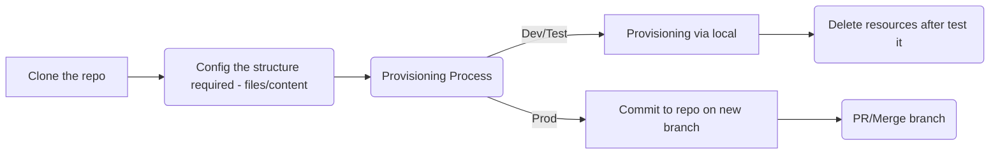
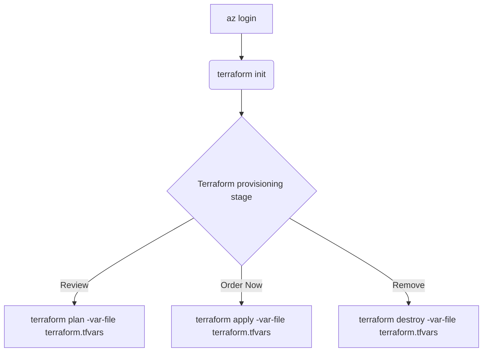

# Terraform Overview

Costa Rica

 

 [brown9804](https://github.com/brown9804)

Last updated: 2025-07-11

----------------------

# Content:

  
- [Terraform](./1-terraform)
  - Lab 0 - [Installing Terraform and Working with Terraform Providers](./1-terraform/lab0)
  - Lab 1 - [Using Terraform CLI Commands (workspace and state) to Manipulate a Terraform Deployment](./1-terraform/lab1)
  - Lab 2 - [Building and Testing a Basic Terraform Module](./1-terraform/lab2)
  - Lab 3 - [Exploring Terraform State Functionality](./1-terraform/lab3)
  - Lab 4 - [Deploy an Azure Storage Account with Terraform](./1-terraform/lab4)
  - Lab 5 - [Deploy an Azure File Share and Blob Storage with Terraform](./1-terraform/lab5)
  - Lab 6 - [Deploy Azure VNETs and Subnets with Terraform](./1-terraform/lab6)
  - Lab 7 - [Create Azure NSGs with Terraform](./1-terraform/lab7)
  - Lab 8 - [Deploying an Azure VM with Terraform](./1-terraform/lab8)
  - Lab 9 - [Deploy a Web Application with Terraform](./1-terraform/lab9)
  - Lab 10 - [Deploy a MySQL Database with Terraform](./1-terraform/lab_10)
  - Lab 11 - [Migrating Terraform State to Terraform Cloud](./1-terraform/lab_11)
  - Lab 12 - [Using Terraform Provisioners to Set Up an Apache Web Server on AWS](./1-terraform/lab_12)
  - Lab 13 - [Make Changes to AWS Infrastructure Using Terraform](./1-terraform/lab_13)
  - Lab 14 - [Use Output Variables to Query Data in AWS Using Terraform](./1-terraform/lab_14)
  - Lab 15 - [Make Changes to Azure Infrastructure Using Terraform](./1-terraform/lab_15)
  - Lab 16 - [Use Output Variables to Query Data in Azure Using Terraform](./1-terraform/lab_16)
  - Lab 17 - [Use Terraform to Create a Kubernetes Deployment](./1-terraform/lab_17)
  - Lab 18 - [Manage Kubernetes Resources with Terraform](./1-terraform/lab_18)
  - Lab 19 - [Use Terraform to Create an EKS Deployment](./1-terraform/lab_19)
  - Lab 20 - [Troubleshooting a Terraform Deployment](./1-terraform/lab_20)
  

## Wiki 

- Terraform - [Standard Module Structure](https://developer.hashicorp.com/terraform/language/modules/develop/structure)
~~~
.
├── README.md
├── main.tf
├── variables.tf
├── provider.tf
├── terraform.tfvars
├── remote-storage.tf
├── outputs.tf
~~~

- Terraform - [Terraform Enterprise related projects, tools, and resources](https://github.com/hashicorp/awesome-terraform-enterprise)
- Terraform - [Operating Model](https://www.datocms-assets.com/2885/1560359028-terraformoperatingmodelwhitepaper.pdf)

- Terraform - [Using Terraform to Manage Applications and Infrastructure](https://www.pluralsight.com/cloud-guru/courses/using-terraform-to-manage-applications-and-infrastructure)
- Terraform - [Terraform Cheat Sheet – 23 Terraform CLI Commands & Examples](https://spacelift.io/blog/terraform-commands-cheat-sheet)

- Terraform - [GitHub Reference on Using Terraform to Manage Applications and Infrastructure](https://github.com/Bes0n/Using-Terraform-to-Manage-Applications-and-Infrastructure)

| Topic | Reference | 
| --- | --- |
| Multi-Cloud Infrastructure Provisioning |  |
| Terraform Open Source |  | 
| Terraform Enterprise |  |
| Workspace Structure |  | 
| Using Modules for Self-Service Infrastructure |  |

<!-- START BADGE -->

  
  
Refresh Date: 2025-07-22

<!-- END BADGE -->
